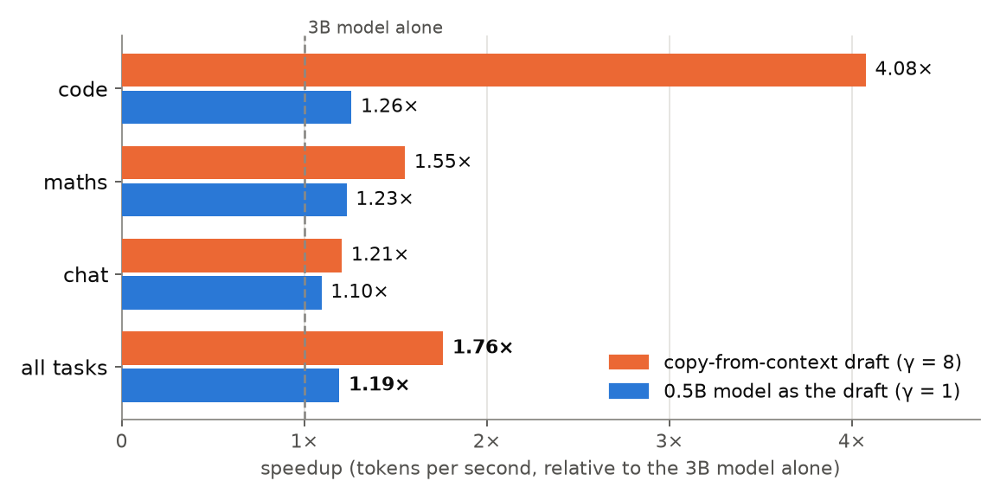
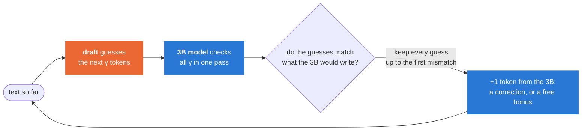
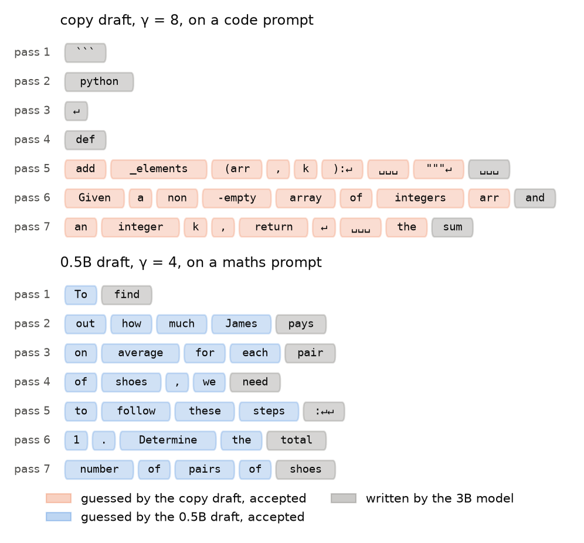
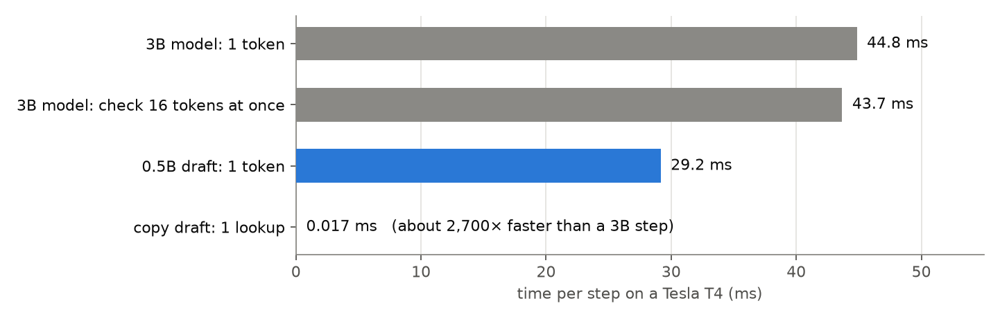
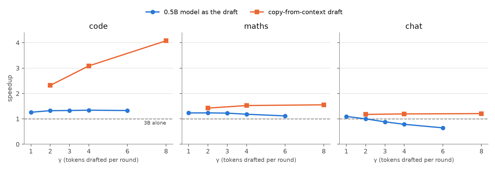
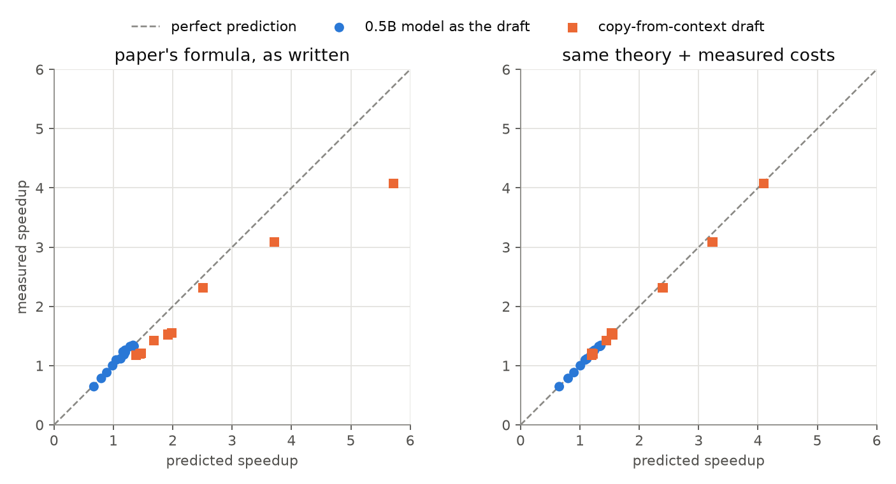
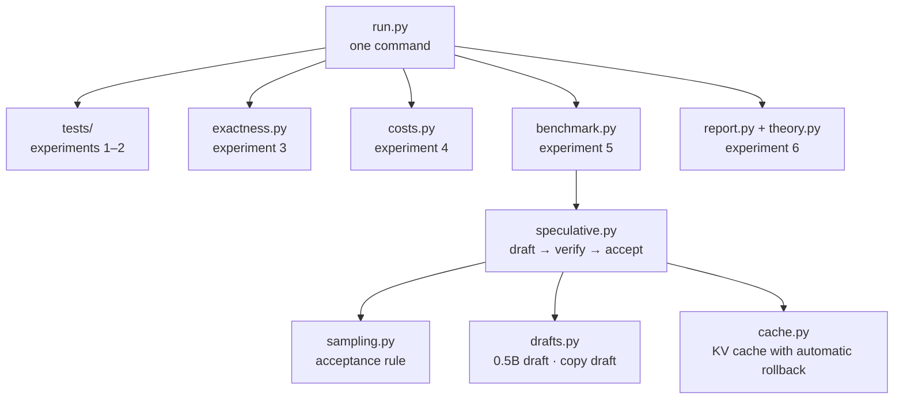

<div align="center">

# Speculative Decoding, from Scratch

**A small drafter guesses. A big model checks. The output stays exactly the same, only faster.**

A from-scratch PyTorch implementation of [*Fast Inference from Transformers via Speculative Decoding*](https://arxiv.org/abs/2211.17192) (ICML 2023),<br/>
measured on Qwen2.5-3B and checked against the paper's own theory.

[](https://arxiv.org/abs/2211.17192)
[](https://pytorch.org)
[](https://github.com/huggingface/transformers)
[](https://huggingface.co/Qwen/Qwen2.5-3B-Instruct)
[](tests/)
[](LICENSE)

<br/>

<table>
<tr>
<td align="center" width="25%"><h1>1.76×</h1>faster overall<br/><sub>with a draft that just copies<br/>from the context</sub></td>
<td align="center" width="25%"><h1>4.08×</h1>faster on code<br/><sub>same draft, when the answer<br/>echoes the prompt</sub></td>
<td align="center" width="25%"><h1>1.4%</h1>theory error<br/><sub>the paper's model, fed measured<br/>costs, predicts every result</sub></td>
<td align="center" width="25%"><h1>0.4%</h1>run-to-run spread<br/><sub>repeated in a fresh session<br/>on a different GPU</sub></td>
</tr>
</table>

<picture>
  <source media="(prefers-color-scheme: dark)" srcset="docs/figures/hero-dark.png">
  
</picture>

</div>

---

## The idea in one picture

Generating text normally takes **one full pass of the big model per token**. But a pass that *checks* many tokens costs about the same as a pass that *writes* one. So let something cheap guess ahead, and let the big model verify all the guesses at once:



The acceptance rule is built so that the result follows **exactly** the big model's probabilities. With greedy decoding, the text is identical token for token.

### What it looks like on real text

Every line below is **one pass of the 3B model**, taken from the actual benchmark run. Coloured tokens were guessed and accepted; grey tokens are the 3B's own.

<picture>
  <source media="(prefers-color-scheme: dark)" srcset="docs/figures/trace-dark.png">
  
</picture>

The copy draft finds nothing to copy for four passes, then recognises the docstring from the prompt and lands **9 tokens per pass**. The 0.5B draft guesses well on maths (4 of 4 on six of seven passes), but each guess costs two-thirds of a 3B step.

---

## The one number that explains everything

The paper predicts the speedup from three quantities: how often guesses are accepted (**α**), how many are drafted per round (**γ**), and how much one draft step costs relative to one target step (**c**):

$$\text{speedup} \;=\; \frac{1-\alpha^{\gamma+1}}{(1-\alpha)\,(\gamma c+1)}$$

The paper's drafts are about 100× smaller than the target, so **c < 0.05**. Here the 0.5B draft is 6× smaller, but on a T4 in plain PyTorch each step's time is mostly fixed framework overhead, not model size:

<picture>
  <source media="(prefers-color-scheme: dark)" srcset="docs/figures/costs-dark.png">
  
</picture>

| | 0.5B draft | copy draft |
|---|:---:|:---:|
| cost per guess, **c** | **0.65** of a 3B step | **0.0004** of a 3B step |
| guesses accepted, **α** (code / maths / chat) | 0.98 / 0.92 / 0.73 | 0.88 / 0.50 / 0.32 |
| best γ | 1 | 8 (the largest tested) |
| verdict | great guesses, too expensive to make many | worse guesses, but free, so guess a lot |

Checking 16 tokens costs the same as writing 1 (43.7 ms against 44.8 ms), so the paper's key assumption holds. The limit is the draft's price.

---

## Guess further ahead?

<picture>
  <source media="(prefers-color-scheme: dark)" srcset="docs/figures/speedup-vs-gamma-dark.png">
  
</picture>

- **The copy draft** only gets better with longer guesses, because a wrong guess costs nothing.
- **The 0.5B draft** peaks at γ = 1–2. On chat, where its guesses are right only 73% of the time, drafting 6 tokens makes generation **slower than the 3B alone** (0.65×).

---

## Does the paper's theory hold?

Yes, once it's fed measured inputs. The prediction is built up in three layers, each adding one measurement:

<picture>
  <source media="(prefers-color-scheme: dark)" srcset="docs/figures/theory-dark.png">
  
</picture>

| Prediction | Adds | Error, 0.5B draft | Error, copy draft |
|---|---|:---:|:---:|
| **A.** paper's formula, as written | measured α, γ, c | 2.3% | 22.3% |
| **B.** + real costs | measured verification cost; how many tokens each round actually proposed | 1.5% | 4.1% |
| **C.** + real rounds | the tokens each round actually produced | **0.9%** | **2.1%** |

<sub>Mean absolute error over 24 settings (8 draft settings × 3 tasks). The formula overshoots the copy draft because it assumes a guess every round, while the copy draft finds a match in only about half of them. Details: <a href="specdec/theory.py"><code>specdec/theory.py</code></a>.</sub>

---

## Is the output really unchanged?

| Check | How | Result |
|---|---|:---:|
| **The acceptance rule** | 1,000,000 rounds per case against synthetic distributions (normal, one-hot, nearly equal, disjoint), with chi-square tests | ✅ |
| **The whole loop** | tiny random models with a 6-token vocabulary, where the exact probability of every 3-token output can be listed and compared, with and without the KV cache | ✅ |
| **The cache** | a 300-step random walk of appends, rewrites and rollbacks, each compared with a fresh forward pass | ✅ |
| **The tests themselves** | four deliberately planted bugs; the tests catch every one | ✅ |
| **The real models, float32** | speculative output identical to the 3B alone, token for token | ✅ |
| **Every benchmark output, float16** | 229 of 240 identical; the other 11 are exact ties flipped by rounding (logit gaps 0.016 to 0.031), confirmed by re-reading each one | ✅ |

---

## Reproducible

Every run is one command that writes its own results and report. The final run was repeated in a fresh Kaggle session on a different T4:

| Run | Code | Overall, copy draft | Overall, 0.5B draft | 3B alone | Time |
|---|:---:|:---:|:---:|:---:|:---:|
| trial | older | 1.69× | 1.20× | 22.2 tok/s | – |
| **final** ([report](report/20260930-035822/README.md)) | `5603bf1` | **1.76×** | **1.19×** | 22.0 tok/s | 39 min |
| **repeat** ([report](report/20260930-050746/README.md)) | same measurement code | **1.76×** | **1.19×** | 20.6 tok/s | 41 min |

The repeat's GPU was about 6% slower, yet all 32 speedups (8 draft settings × 3 tasks and overall) matched the final run within **0.4% on average (1.5% at most)**, and all **351 outputs were token-for-token identical**.

---

## Run it yourself

<table>
<tr><td>

**On Kaggle (free, about 40 minutes)**

1. Create a notebook from [`kaggle/run.ipynb`](kaggle/run.ipynb)
2. Accelerator **GPU T4 x2**, Internet **On**
3. **Save Version → Save & Run All**

</td><td>

**On any CUDA machine**

```bash
pip install -r requirements.txt
python -m specdec.run            # full run
python -m specdec.run --quick    # quick smoke test
```

</td></tr>
</table>

Each run writes `results/<run id>/` (raw data) and `report/<run id>/README.md` (tables and charts).

---

<details>
<summary><b>How the code fits together</b></summary>

<br/>



| File | What it does |
|---|---|
| [`specdec/sampling.py`](specdec/sampling.py) | The acceptance rule, vectorised, in float32, with a guard for an empty leftover distribution |
| [`specdec/speculative.py`](specdec/speculative.py) | The loop, with one GPU sync per round |
| [`specdec/cache.py`](specdec/cache.py) | Keeps the longest matching cached prefix, so rejected guesses are rolled back automatically |
| [`specdec/drafts.py`](specdec/drafts.py) | The 0.5B draft and the n-gram copy draft, behind one interface |
| [`specdec/theory.py`](specdec/theory.py) | The paper's formula and the refined cost model |

</details>

<details>
<summary><b>How this differs from the paper</b></summary>

<br/>

| | Paper | This project |
|---|---|---|
| Hardware | TPU-v4, T5X | one Tesla T4, PyTorch eager mode |
| Target / draft | T5-XXL 11B / T5-small 77M (about 140×) | Qwen2.5-3B / Qwen2.5-0.5B (6×), plus a copy draft |
| Cost ratio c | below 0.05 | 0.65 (framework overhead) |
| Timed decoding | greedy and sampling | greedy (sampling tested for correctness only) |
| Scale | full datasets | 30 prompts, 128 new tokens |

The code prompts ask for "the full function", so the model repeats the docstring, which favours the copy draft.

</details>

<details>
<summary><b>Repository layout</b></summary>

<br/>

| Path | Contents |
|---|---|
| `specdec/` | Implementation and experiments |
| `tests/` | Correctness tests |
| `prompts.json` | 30 prompts (HumanEval, GSM8K, MT-Bench), built by `scripts/make_prompts.py` from pinned sources |
| `kaggle/run.ipynb` | The notebook that reproduces everything |
| `results/`, `report/` | Raw data and generated reports per run |
| `docs/figures/` | This page's figures, built by `scripts/make_readme_figures.py` |
| `speculative-decoding-plan.md` | The project plan, with notes from every step |
| `reports/`, `research_notes/` | Background research behind the plan |

</details>

<details>
<summary><b>Licences</b></summary>

<br/>

Code: MIT ([`LICENSE`](LICENSE)). Prompts, models and model outputs have their own licences; see [`DATA_LICENSES.md`](DATA_LICENSES.md). Qwen2.5-3B-Instruct and the outputs in `results/` are for research or evaluation use only.

</details>
