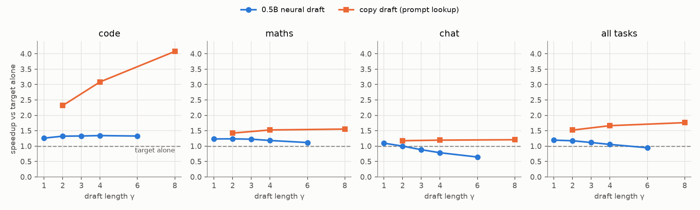
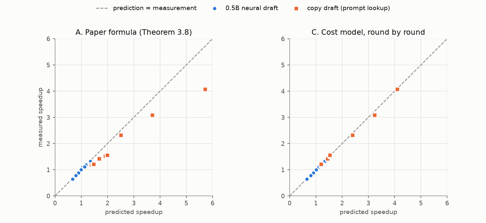
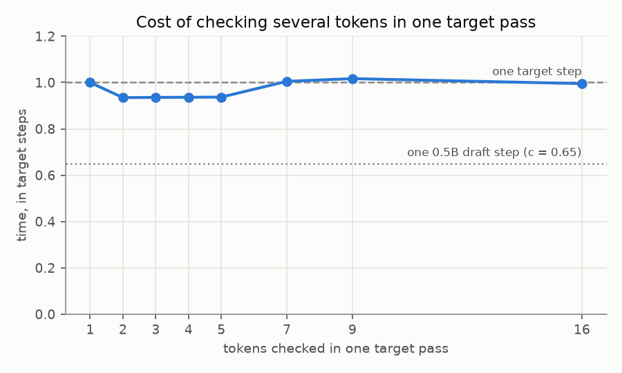

# Results: run 20260930-035822

Qwen2.5-3B-Instruct target, greedy decoding, 10 prompts per task, up to 128 new tokens. Tesla T4, Tesla T4; torch 2.10.0+cu128, transformers 5.17.0, CUDA 12.8. Code at commit `5603bf1`.

## Headline

- **0.5B neural draft**: best setting neural-g1, **1.19×** overall (code 1.26×, maths 1.23×, chat 1.10×).
- **copy draft (prompt lookup)**: best setting copy-g8, **1.76×** overall (code 4.08×, maths 1.55×, chat 1.21×).
- Cost ratio c = 0.650 for the 0.5B draft and 0.0004 for the copy draft. Checking 2 to 16 tokens in one pass costs 0.93 to 1.02 of one target step.

## Speedup by task (experiment 5)

Tokens per second relative to the target alone, total tokens over total time per task.

| Setting | code | maths | chat | all | tokens/s (all) |
|---|---|---|---|---|---|
| baseline | 1.00× | 1.00× | 1.00× | 1.00× | 22.0 |
| neural-g1 | 1.26× | 1.23× | 1.10× | 1.19× | 26.3 |
| neural-g2 | 1.32× | 1.24× | 1.00× | 1.17× | 25.8 |
| neural-g3 | 1.33× | 1.22× | 0.88× | 1.12× | 24.6 |
| neural-g4 | 1.34× | 1.18× | 0.78× | 1.05× | 23.2 |
| neural-g6 | 1.33× | 1.12× | 0.65× | 0.95× | 20.9 |
| copy-g2 | 2.32× | 1.42× | 1.18× | 1.52× | 33.5 |
| copy-g4 | 3.09× | 1.52× | 1.19× | 1.66× | 36.6 |
| copy-g8 | 4.08× | 1.55× | 1.21× | 1.76× | 38.8 |

## Acceptance

α is accepted draft tokens over evaluated draft tokens (accepted plus the first rejection per round). Match rate is the share of rounds where the draft proposed anything (the copy draft proposes nothing when it finds no match; those rounds are excluded from α). In greedy decoding the two α estimators of the plan are identical by construction, since min(p, q) is 1 or 0.

| Setting | α code | α maths | α chat | match rate | tokens per round |
|---|---|---|---|---|---|
| neural-g1 | 0.98 | 0.92 | 0.73 | 0.99 | 1.86 |
| neural-g2 | 0.98 | 0.92 | 0.73 | 0.99 | 2.60 |
| neural-g3 | 0.98 | 0.92 | 0.72 | 0.99 | 3.22 |
| neural-g4 | 0.98 | 0.92 | 0.72 | 0.99 | 3.72 |
| neural-g6 | 0.98 | 0.92 | 0.73 | 0.99 | 4.57 |
| copy-g2 | 0.83 | 0.47 | 0.30 | 0.60 | 1.50 |
| copy-g4 | 0.85 | 0.49 | 0.31 | 0.56 | 1.65 |
| copy-g8 | 0.88 | 0.50 | 0.32 | 0.53 | 1.75 |

## Theory vs measurement (experiment 6)

Predicted speedup in three layers (see `specdec/theory.py`): **A** the paper's formula with the measured α, γ and c; **B** adds the measured verification cost and the draft tokens actually proposed each round; **C** also uses the tokens each round actually produced, dropping the equal-acceptance assumption. The cost model ignores reading the prompt and Python overhead.

| Setting | Task | α | A paper | B cost model | C round by round | Measured |
|---|---|---|---|---|---|---|
| neural-g1 | code | 0.98 | 1.20 | 1.25 | 1.25 | 1.26 |
| neural-g1 | maths | 0.92 | 1.16 | 1.21 | 1.21 | 1.23 |
| neural-g1 | chat | 0.73 | 1.05 | 1.09 | 1.09 | 1.10 |
| neural-g1 | all | 0.87 | 1.13 | 1.18 | 1.18 | 1.19 |
| neural-g2 | code | 0.98 | 1.28 | 1.32 | 1.32 | 1.32 |
| neural-g2 | maths | 0.92 | 1.20 | 1.23 | 1.23 | 1.24 |
| neural-g2 | chat | 0.73 | 0.99 | 1.02 | 1.01 | 1.00 |
| neural-g2 | all | 0.88 | 1.15 | 1.18 | 1.17 | 1.17 |
| neural-g3 | code | 0.98 | 1.31 | 1.34 | 1.34 | 1.33 |
| neural-g3 | maths | 0.92 | 1.20 | 1.23 | 1.22 | 1.22 |
| neural-g3 | chat | 0.72 | 0.89 | 0.91 | 0.90 | 0.88 |
| neural-g3 | all | 0.87 | 1.11 | 1.14 | 1.13 | 1.12 |
| neural-g4 | code | 0.98 | 1.33 | 1.36 | 1.35 | 1.34 |
| neural-g4 | maths | 0.92 | 1.18 | 1.20 | 1.19 | 1.18 |
| neural-g4 | chat | 0.72 | 0.80 | 0.81 | 0.80 | 0.78 |
| neural-g4 | all | 0.87 | 1.07 | 1.09 | 1.07 | 1.05 |
| neural-g6 | code | 0.98 | 1.35 | 1.35 | 1.34 | 1.33 |
| neural-g6 | maths | 0.92 | 1.12 | 1.12 | 1.12 | 1.12 |
| neural-g6 | chat | 0.73 | 0.67 | 0.68 | 0.65 | 0.65 |
| neural-g6 | all | 0.88 | 0.99 | 0.99 | 0.95 | 0.95 |
| copy-g2 | code | 0.83 | 2.50 | 2.45 | 2.40 | 2.32 |
| copy-g2 | maths | 0.47 | 1.68 | 1.46 | 1.45 | 1.42 |
| copy-g2 | chat | 0.30 | 1.38 | 1.21 | 1.20 | 1.18 |
| copy-g2 | all | 0.56 | 1.87 | 1.58 | 1.55 | 1.52 |
| copy-g4 | code | 0.85 | 3.71 | 3.42 | 3.23 | 3.09 |
| copy-g4 | maths | 0.49 | 1.92 | 1.57 | 1.55 | 1.52 |
| copy-g4 | chat | 0.31 | 1.44 | 1.23 | 1.22 | 1.19 |
| copy-g4 | all | 0.59 | 2.27 | 1.77 | 1.70 | 1.66 |
| copy-g8 | code | 0.88 | 5.71 | 4.38 | 4.10 | 4.08 |
| copy-g8 | maths | 0.50 | 1.98 | 1.53 | 1.53 | 1.55 |
| copy-g8 | chat | 0.32 | 1.47 | 1.20 | 1.20 | 1.21 |
| copy-g8 | all | 0.62 | 2.56 | 1.80 | 1.75 | 1.76 |

## Costs (experiment 4)

Target step 44.8 ms, 0.5B draft step 29.2 ms, n-gram lookup 0.017 ms, measured after a 250-token context.

| Tokens checked | 1 | 2 | 3 | 4 | 5 | 7 | 9 | 16 |
|---|---|---|---|---|---|---|---|---|
| Time (target steps) | 1.00 | 0.93 | 0.94 | 0.94 | 0.94 | 1.01 | 1.02 | 1.00 |

## Correctness

- Experiment 3, 128 tokens on one prompt per task: float32 strict exact match **pass**, float16 teacher-forced check **pass** (near-tie threshold 0.1).
- Speculative outputs that differ from the baseline in float16: 11 of 240.
- Teacher-forced check of every differing output: 11 of 11 are explained by near-ties (every token is the target's top choice or within the threshold of it).

## Run conditions

- GPU temperature 75 to 78 °C, SM clock 1170 to 1575 MHz. Configurations were interleaved, so clock changes affect all of them.
- Across 3 repeated passes over one prompt per task, the largest standard deviation of a speedup was 0.009 (neural-g1).
- Peak GPU memory 7.4 GB.
